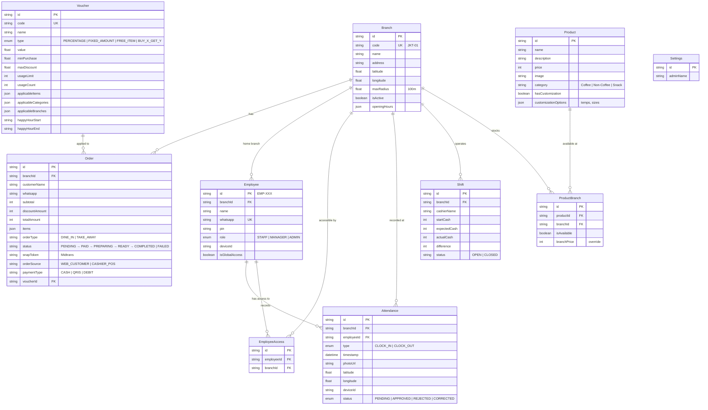
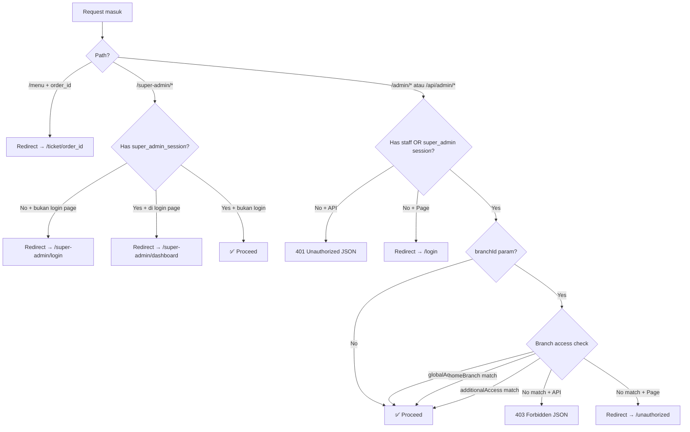

# 📊 Analisa Menyeluruh — Tiknol Reserve Web ("Nol Coffee")

> **Sistem POS (Point-of-Sale) & Digital Ordering multi-cabang** untuk bisnis kopi,
> dibangun sebagai **Progressive Web App (PWA)** full-stack dengan Next.js 15.

---

## 1. Arsitektur & Teknologi

| Layer | Teknologi | Detail |
|---|---|---|
| **Framework** | Next.js 15 (App Router) | Server & Client Components, API Routes, Middleware |
| **Language** | TypeScript 5 | End-to-end type safety |
| **Database** | PostgreSQL (via Supabase) | Hosted DB dengan `DATABASE_URL` + `DIRECT_URL` |
| **ORM** | Prisma 5.10 | Schema-first, type-safe queries, migrations |
| **Storage** | Supabase Storage | Upload gambar produk & foto absensi |
| **Styling** | TailwindCSS 4 + PostCSS | Dark/Light theme via `next-themes` |
| **UI Library** | Lucide React (icons), Framer Motion (animasi) | — |
| **Payment** | **Midtrans** (Snap) + **Duitku** | Dual payment gateway |
| **Notification** | WhatsApp API (via internal endpoint) | Notifikasi order ke customer |
| **PWA** | `next-pwa` + Workbox | Service worker, offline capability, installable |
| **Charts** | Recharts 3 | Visualisasi revenue & analytics |
| **Security** | FingerprintJS | Device fingerprinting untuk absensi |
| **Testing** | Jest 30 + ts-jest | Unit & integration tests |
| **Onboarding** | Driver.js | Guided walkthrough/tutorial |
| **Deployment** | Vercel | Serverless deployment |

---

## 2. Struktur Folder

```
tiknol-reserve-web/
├── app/                        # Next.js App Router (halaman + API)
│   ├── (auth)/                 # Route group: Login staff
│   │   └── login/page.tsx
│   ├── (management)/           # Route group: Super Admin panel
│   │   └── super-admin/
│   │       ├── dashboard/      # Dashboard analytics
│   │       ├── branches/       # Manajemen cabang
│   │       ├── employees/      # Manajemen karyawan
│   │       ├── attendance/     # Rekap absensi
│   │       ├── revenue/        # Laporan pendapatan
│   │       ├── vouchers/       # Manajemen voucher/promo
│   │       ├── manage/         # Manajemen produk
│   │       ├── settings/       # Pengaturan sistem
│   │       ├── team/           # Manajemen tim
│   │       └── login/          # Login super admin
│   ├── (public)/               # Route group: Halaman publik customer
│   │   ├── page.tsx            # Landing page + branch selector
│   │   ├── menu/page.tsx       # Menu ordering
│   │   └── ticket/[id]/        # Tiket order + print view
│   ├── (staff)/                # Route group: Panel staff/kasir
│   │   ├── admin/
│   │   │   ├── pos/            # POS (Point of Sale) kasir
│   │   │   ├── pos-history/    # Riwayat transaksi POS
│   │   │   ├── kitchen-online/ # Kitchen Display System
│   │   │   └── menu/           # Lihat menu (staff view)
│   │   └── attendance/         # Clock-in/out karyawan
│   ├── api/                    # 34 API Route Handlers
│   ├── components/             # Shared components (17 files)
│   ├── context/                # React Context (BranchContext)
│   └── utils/                  # Client-side utilities
├── components/                 # Root-level shared components
│   ├── BranchFormModal.tsx
│   ├── BranchSelector.tsx
│   ├── CheckoutButton.tsx
│   ├── MenuWalkthrough.tsx
│   └── TicketWalkthrough.tsx
├── lib/                        # Backend/shared libraries
│   ├── prisma.ts               # Prisma client singleton
│   ├── midtrans.ts             # Midtrans payment integration
│   ├── duitku.ts               # Duitku payment integration
│   ├── whatsapp.ts             # WhatsApp notification
│   ├── fingerprint.ts          # Device fingerprinting
│   └── utils.ts                # cn() utility (clsx + tailwind-merge)
├── prisma/
│   ├── schema.prisma           # Database schema (10 models)
│   ├── migrations/             # 7 migration files
│   └── seed-multibranch.ts     # Seeder data
├── scripts/                    # 21 utility/migration scripts
├── types/                      # TypeScript type definitions
├── __tests__/                  # Unit + Integration tests
├── public/                     # Static assets, manifest, SW
└── middleware.ts               # Auth + Branch access control
```

---

## 3. Database — Entity Relationship

### 3.1 Semua Model (10 Model + 3 Enum)



### 3.2 Aktor/Entitas Utama

| Aktor | Role | Akses |
|---|---|---|
| **Customer** (Public) | Pemesan | Menu, checkout, tiket, print |
| **Staff (Kasir)** | `STAFF` role | POS, kitchen display, history, absensi |
| **Manager** | `MANAGER` role | POS + laporan revenue cabang |
| **Admin** | `ADMIN` role | Semua fitur staff + kelola karyawan |
| **Super Admin** | Cookie-based session | Full control: semua cabang, dashboard, settings |

---

## 4. API Routes (34 Endpoint)

### 🔓 Public API (tanpa auth)

| Endpoint | Method | Fungsi |
|---|---|---|
| `/api/products` | GET | Daftar produk (filter branch) |
| `/api/branches` | GET | Daftar semua cabang aktif |
| `/api/order/[id]` | GET | Detail order by ID |
| `/api/tokenizer` | POST | Generate Midtrans Snap token |
| `/api/payment/check-status` | POST | Cek status pembayaran |
| `/api/payment/methods` | GET | Daftar metode pembayaran (Duitku) |
| `/api/payment/reset` | POST | Reset status pembayaran |
| `/api/cash-order` | POST | Buat order tunai (dari POS) |
| `/api/vouchers/validate` | POST | Validasi kode voucher |
| `/api/notification` | POST | Kirim notifikasi (internal) |
| `/api/notify-whatsapp` | POST | Kirim notifikasi WhatsApp |
| `/api/upload` | POST | Upload file ke Supabase Storage |

### 🔐 Auth API

| Endpoint | Method | Fungsi |
|---|---|---|
| `/api/auth/staff/login` | POST | Login staff (WhatsApp + PIN) |
| `/api/auth/staff/logout` | POST | Logout staff |
| `/api/auth/super-admin/login` | POST | Login super admin |
| `/api/auth/super-admin/logout` | POST | Logout super admin |
| `/api/auth/me` | GET | Info session saat ini |
| `/api/auth/session` | GET | Status session |
| `/api/attendance/clock` | POST | Clock-in/out dengan foto & GPS |
| `/api/attendance/status` | GET | Status absensi hari ini |

### 🛡️ Admin API (Protected via middleware)

| Endpoint | Method | Fungsi |
|---|---|---|
| `/api/admin/orders` | GET | Daftar order per cabang |
| `/api/admin/products` | GET/POST/PUT/DELETE | CRUD produk |
| `/api/admin/employees` | GET/POST/PUT/DELETE | CRUD karyawan |
| `/api/admin/branches` | GET/POST | Daftar & buat cabang |
| `/api/admin/branches/[id]` | PUT/DELETE | Update/hapus cabang |
| `/api/admin/revenue` | GET | Data pendapatan |
| `/api/admin/attendance` | GET | Data absensi |
| `/api/admin/settings` | GET/PUT | Pengaturan sistem |
| `/api/admin/update-status` | PATCH | Update status order |
| `/api/admin/pos-history` | GET | Riwayat transaksi POS |
| `/api/admin/vouchers` | GET/POST | CRUD voucher |
| `/api/admin/vouchers/[id]` | PUT/DELETE | Update/hapus voucher |
| `/api/admin/vouchers/analytics` | GET | Analitik voucher |
| `/api/super-admin/dashboard` | GET | Data dashboard super admin |

---

## 5. Package Dependencies & Fungsinya

### Production Dependencies

| Package | Fungsi |
|---|---|
| `next` ^15.5 | Framework React full-stack (App Router) |
| `react` / `react-dom` 19.0 | UI library |
| `@prisma/client` + [prisma](file:///Users/macbooksale/Work/Projects/tiknol-local/tiknol-reserve-web/prisma/schema.prisma) ^5.10 | ORM type-safe untuk PostgreSQL |
| `@supabase/supabase-js` ^2.91 | Client Supabase (storage, realtime) |
| `midtrans-client` ^1.4 | SDK payment gateway Midtrans |
| `@fingerprintjs/fingerprintjs` ^5.0 | Device fingerprinting (anti-fraud absensi) |
| `framer-motion` ^12.29 | Animasi & transisi React component |
| `lucide-react` ^0.562 | Icon library (SVG icons) |
| `recharts` ^3.7 | Chart/grafik (revenue, analytics) |
| `next-pwa` ^5.6 | Progressive Web App support |
| `workbox-webpack-plugin` ^7.4 | Service worker generation |
| `next-themes` ^0.4 | Dark/light theme switching |
| `clsx` ^2.1 + `tailwind-merge` ^3.4 | Conditional CSS class merging |
| `qrcode.react` ^4.2 | QR Code generator (tiket/order) |
| `driver.js` ^1.4 | Guided tour/walkthrough UI |

### Dev Dependencies

| Package | Fungsi |
|---|---|
| `tailwindcss` ^4 + `@tailwindcss/postcss` | CSS framework |
| `typescript` ^5 | Type checking |
| `jest` ^30 + `ts-jest` ^29 + `@types/jest` | Testing framework |
| `eslint` ^9 + `eslint-config-next` | Code linting |
| `ts-node` ^10 | Eksekusi script TypeScript langsung |

---

## 6. Fitur yang Sudah Dibuat

### ✅ Customer/Public Features
- **Landing page** dengan branch selector (pilih cabang)
- **Digital menu** ordering dengan kategori (Coffee, Non-Coffee, Snack)
- **Product customization** (suhu: ICE/HOT, ukuran: REGULAR/MEDIUM/LARGE)
- **Shopping cart** & checkout flow
- **Dual payment gateway** — Midtrans Snap (QRIS, bank transfer) + Duitku
- **Voucher/promo** system dengan validasi real-time
- **Order ticket** page dengan QR code
- **Print receipt** page untuk struk fisik
- **WhatsApp notification** saat status order berubah
- **Guided onboarding tour** (Driver.js walkthrough)
- **PWA** — installable, offline-ready, push-capable

### ✅ Staff/Kasir Features
- **POS (Point of Sale)** — input order langsung di kasir
- **Cash order** — buat order pembayaran tunai
- **Kitchen Display System (KDS)** — tampilkan order real-time untuk dapur
- **POS History** — riwayat transaksi kasir
- **Attendance** — clock-in/out karyawan dengan:
  - 📷 Foto wajah (camera capture)
  - 📍 Geolocation (GPS validation terhadap radius cabang)
  - 🔒 Device fingerprinting (cegah kecurangan)

### ✅ Super Admin / Management Features
- **Dashboard** analitik (revenue, order count, charts)
- **Multi-branch management** — CRUD cabang, geofencing per cabang
- **Product management** — CRUD produk, atur ketersediaan per cabang, harga override per cabang
- **Employee management** — CRUD karyawan, assign role & branch, global/multi-branch access
- **Shift management** — buka/tutup shift kasir, rekonsiliasi kas
- **Revenue reporting** — laporan pendapatan per cabang
- **Attendance management** — review & approve/reject absensi, koreksi manual
- **Voucher system** — buat promo (percentage, fixed, free item, BOGO/buy-X-get-Y), atur:
  - Periode berlaku, batas penggunaan, minimum pembelian
  - Applicable items/categories/branches, happy hour
  - Analytics performa voucher
- **Settings** — pengaturan global sistem
- **Team management** — kelola tim & akses

### ✅ Security & Auth
- **Cookie-based auth** — `staff_session` & `super_admin_session`
- **Middleware protection** — route `/admin/*` & `/api/admin/*` dilindungi
- **Branch access control** — validasi akses karyawan ke cabang (global/home/additional)
- **Role-based access** — `STAFF`, `MANAGER`, `ADMIN` enum di Employee
- **Device binding** — device fingerprint diikat ke karyawan

### ✅ Infrastructure
- **7 database migrations** — evolusi schema bertahap
- **21 utility scripts** — seed data, migration, fix data, analisa
- **14 test files** — unit & integration test (Jest)
- **Skeleton loading states** — 9 skeleton components untuk UX loading
- **Theme support** — dark/light mode via next-themes
- **SEO** — metadata, viewport, manifest PWA

---

## 7. Middleware & Flow Keamanan



---

## 8. Ringkasan Arsitektur

```
┌──────────────────────────────────────────────────────────┐
│                     FRONTEND (React 19)                  │
│  ┌─────────┐ ┌──────────┐ ┌────────┐ ┌───────────────┐  │
│  │ Customer │ │  Staff   │ │  POS   │ │  Super Admin  │  │
│  │  Menu    │ │Attendance│ │ Kasir  │ │  Dashboard    │  │
│  └────┬─────┘ └────┬─────┘ └───┬────┘ └──────┬────────┘  │
│       └────────────┴───────────┴─────────────┘           │
│                BranchContext + ThemeProvider              │
├──────────────────────────────────────────────────────────┤
│                   MIDDLEWARE (Auth Gate)                  │
├──────────────────────────────────────────────────────────┤
│                  BACKEND (Next.js API Routes)            │
│  ┌─────────┐ ┌──────────┐ ┌─────────┐ ┌─────────────┐  │
│  │ Orders  │ │ Products │ │  Auth   │ │  Payment    │   │
│  │ CRUD    │ │ CRUD     │ │ Session │ │ Midtrans +  │   │
│  │         │ │          │ │         │ │ Duitku      │   │
│  └────┬────┘ └────┬─────┘ └────┬────┘ └──────┬──────┘   │
│       └───────────┴────────────┴─────────────┘           │
├──────────────────────────────────────────────────────────┤
│                     LIB / SERVICES                       │
│   prisma.ts · midtrans.ts · duitku.ts · whatsapp.ts     │
│   fingerprint.ts · utils.ts                              │
├──────────────────────────────────────────────────────────┤
│                    DATABASE (PostgreSQL)                  │
│              Hosted on Supabase  │  Prisma ORM           │
│  Branch · Order · Product · ProductBranch · Employee     │
│  EmployeeAccess · Attendance · Shift · Voucher · Settings│
├──────────────────────────────────────────────────────────┤
│                   EXTERNAL SERVICES                      │
│  Supabase Storage · Midtrans · Duitku · WhatsApp API     │
└──────────────────────────────────────────────────────────┘
```
